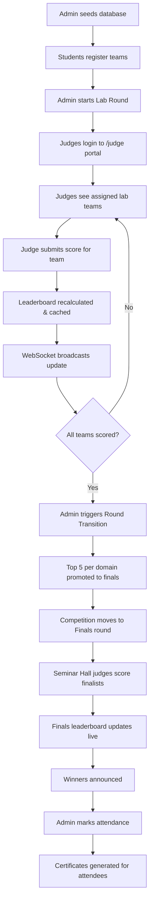

# TechBlitz Judge — Project Workflow & Reference Guide

## Project Overview

**TechBlitz Judge** is a full-stack competition management platform built for the **TechBlitz 2026** hackathon event organized by VCET NSDC. It orchestrates a multi-lab, multi-domain coding competition with a two-round structure:

1. **Lab Round** — Teams compete simultaneously in 7 physical labs, each mapped to a specific domain. Lab-assigned judges evaluate and score teams in real time.
2. **Finals (Seminar Hall)** — The top 5 teams per domain are automatically promoted to the Seminar Hall for a final evaluation by Seminar Hall judges.

### Key Features

| Feature | Description |
|---|---|
| **Multi-Lab Management** | 7 physical labs (114A, 114B, 308A, 308B, 220, 221, 222) + 1 Seminar Hall |
| **3 Competition Domains** | Agentic AI, UI/UX Challenge, Vibecoding — each with independent scoring & leaderboards |
| **Judge Portal** | Secure login, lab-specific team views, score submission with criteria & feedback |
| **Real-Time Leaderboards** | Auto-calculated via MongoDB aggregation; cached in-memory; broadcast via WebSocket |
| **Round Transition** | Admin-triggered promotion of top-N teams to Seminar Hall finals |
| **Admin Dashboard** | Full CRUD for teams, judges, competition state, attendance, and certificates |
| **Certificate Generation** | Search teams, generate participation certificates for attended members |
| **Student Registration** | Self-service team registration with domain/lab selection |

---

## Architecture

### High-Level Diagram

```
┌─────────────────────────────────────────────────────────┐
│                    Next.js 16 App                       │
│  ┌──────────┐  ┌──────────┐  ┌────────────────────┐    │
│  │  Judge    │  │  Admin   │  │  Public            │    │
│  │  Portal   │  │  Panel   │  │  (Leaderboard,     │    │
│  │  /judge/* │  │  /admin/*│  │   Certs, Register) │    │
│  └────┬─────┘  └────┬─────┘  └────────┬───────────┘    │
│       │              │                 │                │
│  ┌────▼──────────────▼─────────────────▼───────────┐    │
│  │              API Routes (/api/*)                 │    │
│  │  judge/*  admin/*  auth/*  leaderboards/*  ...   │    │
│  └────────────────────┬────────────────────────────┘    │
│                       │                                 │
│  ┌────────────────────▼────────────────────────────┐    │
│  │              Service Layer (lib/)                │    │
│  │  AuthService · LeaderboardService · CacheService │    │
│  │  WebSocketHandler · CompetitionCacheService       │    │
│  └────────────────────┬────────────────────────────┘    │
│                       │                                 │
│  ┌────────────────────▼────────────────────────────┐    │
│  │          Mongoose ODM (models/)                  │    │
│  │  Lab · Domain · Team · Judge · Score             │    │
│  │  Competition · CertificateConfig · AuditLog      │    │
│  └────────────────────┬────────────────────────────┘    │
│                       │                                 │
└───────────────────────┼─────────────────────────────────┘
                        │
                ┌───────▼───────┐
                │   MongoDB     │
                │  (Atlas/local)│
                └───────────────┘
```

### Design Patterns

- **Next.js App Router** — File-system-based routing with `route.ts` handlers for API and `page.tsx` for UI.
- **Service Layer** — Business logic is encapsulated in classes (`AuthService`, `LeaderboardService`, `CompetitionCacheService`) separate from route handlers.
- **In-Memory Caching** — Singleton `CacheService` and `CompetitionCacheService` use `Map` with TTL-based expiry. No external Redis dependency at runtime.
- **JWT Authentication** — Access token (1h) + refresh token (7d in HTTP-only cookie). Middleware extracts tokens from `Authorization` header or `accessToken` cookie.
- **Rate Limiting** — In-memory sliding window (5 attempts/min per identifier) on login endpoints.
- **WebSocket** — Socket.io server broadcasts leaderboard updates; score update queue processed every 5 seconds.
- **Zod Validation** — Request bodies validated with Zod schemas before processing.

---

## Folder Structure

```
judge/
├── .env / .env.local / .env.example   # Environment configuration
├── seed.ts                            # Database seeding script (labs, domains, judges, competition)
├── package.json                       # Dependencies & scripts
├── next.config.ts                     # Next.js configuration
├── tsconfig.json                      # TypeScript configuration
├── components.json                    # shadcn/ui configuration
│
├── public/                            # Static assets (images, icons)
│
└── src/
    ├── app/                           # Next.js App Router
    │   ├── globals.css                # Global styles (Tailwind CSS)
    │   ├── Providers.tsx              # React Query + client-side providers
    │   ├── favicon.ico
    │   │
    │   ├── judge/                     # Judge portal pages
    │   │   ├── dashboard/page.tsx     # Judge home — see assigned teams
    │   │   ├── evaluate/[teamId]/     # Score evaluation form for a single team
    │   │   ├── lab/[labId]/           # Lab-specific view
    │   │   ├── leaderboard/           # Judge leaderboard view
    │   │   └── seminar-hall/          # Seminar Hall judge dashboard
    │   │
    │   ├── admin/                     # Admin panel pages
    │   │   ├── page.tsx               # Admin login page
    │   │   ├── layout.tsx             # Admin layout shell
    │   │   ├── dashboard/             # Admin home overview
    │   │   ├── teams/                 # Team CRUD management
    │   │   ├── judges/                # Judge CRUD management
    │   │   ├── competition/           # Competition state & round transition
    │   │   ├── seminar-hall/          # Seminar Hall qualifier view
    │   │   ├── attendance/            # Mark team member attendance
    │   │   └── certificates/          # Certificate template config & generation
    │   │
    │   ├── certificates/page.tsx      # Public certificate search & download
    │   │
    │   └── api/                       # All API routes (see Routes section below)
    │       ├── auth/                  # Cookie-based auth (admin/generic login)
    │       ├── judge/                 # Judge-specific endpoints
    │       ├── admin/                 # Admin-only endpoints
    │       ├── teams/                 # Public team lookup
    │       ├── domains/               # Domain listing
    │       ├── labs/                  # Lab listing
    │       ├── leaderboards/          # Public leaderboard data
    │       ├── competition/           # Public competition status
    │       ├── certificates/          # Certificate search & generation
    │       └── internal/              # Internal/hidden certificate generation
    │
    ├── components/
    │   ├── ComicUI.tsx                # Themed UI wrapper component
    │   ├── Layout.tsx                 # Main application layout
    │   └── ui/                        # shadcn/ui primitives (Button, Dialog, Tabs, etc.)
    │
    ├── hooks/
    │   ├── use-auth.ts                # JWT auth state management hook
    │   ├── use-teams.ts               # Team data fetching hook
    │   ├── use-cache-clear.ts         # Admin cache invalidation hook
    │   ├── use-toast.ts               # Toast notification hook
    │   └── use-mobile.tsx             # Responsive breakpoint detection
    │
    ├── lib/
    │   ├── mongodb.ts                 # Mongoose connection singleton
    │   ├── auth.ts                    # AuthService — JWT sign/verify, bcrypt, judge CRUD
    │   ├── leaderboard.ts             # LeaderboardService — aggregation, cache, sync
    │   ├── cache.ts                   # Generic in-memory cache (Map + TTL)
    │   ├── competition-cache.ts       # Competition-specific cache (leaderboards, sessions, score queue)
    │   ├── websocket.ts               # Socket.io server + WebSocketHandler
    │   ├── rate-limit.ts              # In-memory rate limiter (5 req/min/identifier)
    │   ├── cache-clear.ts             # Bulk cache invalidation utilities
    │   ├── certificates.ts            # Certificate search & attended member retrieval
    │   ├── queryClient.ts             # React Query client configuration
    │   ├── utils.ts                   # General utilities (cn helper)
    │   └── middleware/
    │       └── auth.ts                # Token extraction & verification middleware
    │
    ├── models/                        # Mongoose schemas & models
    │   ├── index.ts                   # Barrel export + auto-connect
    │   ├── Lab.ts                     # Lab/venue model
    │   ├── Domain.ts                  # Competition domain model
    │   ├── Team.ts                    # Team model (members, scores, finals qualification)
    │   ├── Judge.ts                   # Judge model (role, lab assignment, domains)
    │   ├── Score.ts                   # Score record (per judge/team/round)
    │   ├── Competition.ts             # Competition state (round, timing, seminar hall)
    │   ├── CertificateConfig.ts       # Certificate template positioning config
    │   └── CertificateAuditLog.ts     # Certificate generation audit trail
    │
    └── types/
        └── competition.ts             # Shared enums & interfaces (CompetitionRound, JudgeRole, etc.)
```

---

## Routes & Endpoints

### Authentication

| Method | Route | Auth | Description |
|--------|-------|------|-------------|
| `POST` | `/api/judge/login` | None | Judge login with email + password. Returns JWT access token + sets refresh token cookie. Rate-limited (5/min). |
| `POST` | `/api/judge/logout` | Judge | Clears session and refresh token cookie. |
| `POST` | `/api/auth/login` | None | Cookie-based login (used by admin panel). Sets `judgeId` and `judgeRole` cookies. |
| `POST` | `/api/auth/logout` | Any | Clears auth cookies. |

### Judge Routes (JWT Required)

| Method | Route | Description |
|--------|-------|-------------|
| `GET` | `/api/judge/teams` | Fetch teams assigned to the judge's lab (or Seminar Hall qualifying teams for seminar judges). Includes `hasScored` flag per team. |
| `GET` | `/api/judge/teams/[teamId]` | Fetch detailed info for a single team. |
| `POST` | `/api/judge/scores` | Submit or update a score for a team. Validates lab/domain assignment, round state, and permissions. Triggers leaderboard recalculation and real-time broadcast. |
| `GET` | `/api/judge/scores?domainId=X&round=Y` | Retrieve the current leaderboard for a domain/round. |
| `GET` | `/api/judge/seminar-hall/teams` | Fetch all teams qualified for finals in the Seminar Hall. |
| `POST` | `/api/judge/seminar-hall/scores` | Submit finals score (Seminar Hall judges only). Validates qualification status and domain access. |
| `GET` | `/api/judge/seminar-hall/scores?domainId=X` | Fetch the finals leaderboard for a domain. |
| `GET` | `/api/judge/seminar-hall/leaderboard` | Combined finals leaderboard across all domains. |

### Admin Routes (Admin JWT Required)

| Method | Route | Description |
|--------|-------|-------------|
| `GET` | `/api/admin/teams` | List all teams with optional filters. |
| `GET/PUT/DELETE` | `/api/admin/teams/[teamId]` | Single team CRUD operations. |
| `GET` | `/api/admin/judges` | List all judges. |
| `POST` | `/api/admin/judges` | Create a new judge account. |
| `GET/PUT/DELETE` | `/api/admin/judges/[judgeId]` | Single judge CRUD operations. |
| `GET` | `/api/admin/competition` | Fetch current active competition state. |
| `POST` | `/api/admin/competition/transition` | **Transition to Finals** — syncs top-N teams to Seminar Hall, updates round to `finals`, clears caches, broadcasts via WebSocket. Body: `{ qualifiedPerDomain?: number }` |
| `GET` | `/api/admin/competition/transition` | Check transition status and list qualified teams. |
| `GET/POST` | `/api/admin/attendance` | View/mark attendance for team members. |
| `GET/POST` | `/api/admin/seminar-hall/qualifiers` | View/manage Seminar Hall qualifiers. |
| `POST` | `/api/admin/cache/clear` | Clear all in-memory caches (leaderboards, sessions, queues). |
| `GET/POST` | `/api/admin/certificates/config` | Get/set certificate template configuration (position, size, colors). |
| `POST` | `/api/admin/certificates/upload` | Upload certificate template image. |

### Public Routes (No Auth)

| Method | Route | Description |
|--------|-------|-------------|
| `GET` | `/api/competition/status` | Current competition state (round, timing, active status). |
| `GET` | `/api/domains` | List all active competition domains. |
| `GET` | `/api/labs` | List all active labs/venues. |
| `GET` | `/api/teams` | List teams (public view). |
| `GET` | `/api/teams/[id]` | Get a single team's public info. |
| `GET` | `/api/leaderboards/[domainId]/[round]` | Domain-specific leaderboard for a given round. |
| `GET` | `/api/leaderboards/finals/[domainId]` | Finals leaderboard for a specific domain. |
| `GET` | `/api/leaderboards/finals/all` | Combined finals leaderboard across all domains. |
| `GET` | `/api/certificates/search?q=teamName` | Search teams for certificate lookup. |
| `POST` | `/api/certificates/generate` | Generate certificates for attended team members. |
| `POST` | `/api/internal/certificates/generate` | Internal/hidden certificate generation endpoint (audit-logged). |

---

## Workflow

### 1. Setup & Initialization

```
npm install          # Install dependencies
cp .env.example .env # Set MONGODB_URI, JWT_SECRET
npm run seed         # Seed labs (7+SH), domains (3), judges (9), competition
npm run dev          # Start development server on port 3000
```

### 2. Competition Flow



### 3. Score Submission Flow (Detail)

1. Judge authenticates via `POST /api/judge/login` → receives JWT.
2. Judge fetches assigned teams via `GET /api/judge/teams`.
3. Judge submits score via `POST /api/judge/scores` with `{ teamId, marks, feedback, round, criteria }`.
4. Server validates: judge assignment, round state, lab/domain permissions.
5. Score is upserted in MongoDB (one score per judge+team+domain+round).
6. `LeaderboardService.invalidateLeaderboard()` clears cached leaderboard for the domain.
7. Fresh leaderboard is recalculated via MongoDB aggregation pipeline (`$match → $lookup → $unwind → $group → $sort`).
8. For lab round scores, `syncTopTeamsToSeminarHall()` updates qualification flags in real time.
9. Score update is queued through `CompetitionCacheService` for WebSocket broadcast.
10. `WebSocketHandler.processScoreUpdates()` runs every 5 seconds, broadcasting to leaderboard rooms.

### 4. Round Transition Flow

1. Admin calls `POST /api/admin/competition/transition` with optional `{ qualifiedPerDomain: N }`.
2. `LeaderboardService.syncTopTeamsToSeminarHall(N)` identifies top N teams per domain.
3. Qualifying teams are marked `qualifiedForFinals: true`, assigned `finalVenueId` to Seminar Hall.
4. Competition state updated: `currentRound → 'finals'`, `finalsStartTime` set.
5. All leaderboard caches cleared.
6. WebSocket broadcasts `round_transition` event to all connected clients.

---

## Technologies & Dependencies

### Core Stack

| Technology | Version | Purpose |
|---|---|---|
| **Next.js** | 16.1.6 | Full-stack React framework (App Router) |
| **React** | 19.2.3 | UI library |
| **TypeScript** | ^5 | Type safety |
| **MongoDB** | — | Primary database |
| **Mongoose** | 9.2.4 | MongoDB ODM with schema validation |

### Authentication & Security

| Library | Purpose |
|---|---|
| `jsonwebtoken` | JWT token generation/verification |
| `bcryptjs` | Password hashing (cost factor 12) |
| `zod` | Request body validation |

### UI & Styling

| Library | Purpose |
|---|---|
| `tailwindcss` v4 | Utility-first CSS framework |
| `shadcn/ui` (Radix UI) | Accessible, composable UI primitives |
| `lucide-react` | Icon library |
| `framer-motion` | Animations |
| `recharts` | Data visualization (charts) |
| `react-hook-form` | Form state management |
| `@tanstack/react-query` | Server state management / data fetching |
| `cmdk` | Command palette component |

### Real-Time & Communication

| Library | Purpose |
|---|---|
| `socket.io` / `socket.io-client` | WebSocket for real-time leaderboard updates |

### Utilities

| Library | Purpose |
|---|---|
| `date-fns` | Date formatting |
| `nanoid` | Unique ID generation |
| `clsx` / `tailwind-merge` | CSS class merging |
| `class-variance-authority` | Component variant management |
| `dotenv` | Environment variable loading (seed script) |
| `tsx` | TypeScript execution for seed script |

---

## Setup & Configuration

### Prerequisites

- **Node.js** 18+
- **MongoDB** instance (local or MongoDB Atlas)

### Environment Variables

Create `.env` (or `.env.local`) from `.env.example`:

```env
# MongoDB Configuration
MONGODB_URI=mongodb://localhost:27017/competition-platform
MONGODB_DB=competition-platform

# JWT Configuration
JWT_SECRET=your-super-secret-jwt-key-change-this-in-production

# Application Configuration
NODE_ENV=development
PORT=3000
```

### Installation & Seeding

```bash
# 1. Install dependencies
npm install

# 2. Seed the database (creates labs, domains, judges, competition)
npm run seed

# 3. Start the dev server
npm run dev
```

### Seeded Data Summary

| Entity | Count | Details |
|---|---|---|
| Labs | 8 | 114A, 114B, 308A, 308B, 220, 221, 222, Seminar Hall |
| Domains | 3 | Agentic AI, Vibecoding, UI/UX Challenge |
| Judges | 9 | 1 per lab + 1 Seminar Hall + 1 Admin |
| Competition | 1 | "TechBlitz 2026", starts in Lab Round |

### Lab → Domain Mapping

| Labs | Domain |
|---|---|
| 114A, 114B | Agentic AI |
| 308A, 308B | UI/UX Challenge |
| 220, 221, 222 | Vibecoding |

### Default Judge Credentials

| Username | Role | Password |
|---|---|---|
| `judge114a` through `judge222` | Lab Round Judge | `NSDC@JUDGE` |
| `judgeseminar` | Seminar Hall Judge | `NSDC@JUDGE` |
| `JUDGETECHBILTZ` | Admin Judge | `NSDC@JUDGE` |

---

## Additional Information

### Database Models Reference

#### Lab
Fields: `name`, `location`, `type` (lab/seminar_hall), `capacity`, `assignedDomain`, `isActive`

#### Domain
Fields: `name`, `description`, `scoringCriteria[]`, `isActive`

#### Team
Fields: `name`, `labId` (ref Lab), `domainId` (ref Domain), `problemStatement`, `githubRepo`, `figmaLink`, `members[]` (name, email, role, attended), `currentScore`, `rank`, `qualifiedForFinals`, `finalVenueId`, `finalScore`, `isActive`

#### Judge
Fields: `name`, `email`, `passwordHash`, `assignedLabId` (ref Lab), `assignedDomains[]` (ref Domain), `role` (lab_round/seminar_hall/admin), `isActive`, `lastLoginAt`

#### Score
Fields: `teamId`, `judgeId`, `domainId`, `venueId`, `round` (lab_round/finals), `marks` (0–100), `criteria[]` (name + marks), `feedback`, `submittedAt`
**Unique constraint**: One score per judge + team + domain + round (enforced at application level via upsert logic).

#### Competition
Fields: `name`, `currentRound`, `seminarHallId`, `qualifiedTeamsPerDomain`, `labRoundStartTime`, `labRoundEndTime`, `finalsStartTime`, `finalsEndTime`, `isActive`

#### CertificateConfig
Fields: `templateImagePath`, `nameX/Y/Size/Color`, `teamX/Y/Size/Color`

#### CertificateAuditLog
Fields: `endpoint`, `actor`, `teamName`, `sessionKey`, `requestedByIp`, `generatedCount`, `success`, `errorMessage`, `generatedAt`

### Caching Strategy

- **In-memory only** — No Redis dependency. Uses singleton `Map`-based stores.
- **Leaderboard cache**: 30-minute TTL. Invalidated on every score submission.
- **Session cache**: 1-hour TTL.
- **Score update queue**: Processed every 5 seconds for WebSocket broadcast.
- **Admin cache clear**: `POST /api/admin/cache/clear` flushes all caches manually.

### Security Model

| Layer | Mechanism |
|---|---|
| **Authentication** | JWT (1h access + 7d refresh in HTTP-only cookie) |
| **Password Storage** | bcrypt with cost factor 12 |
| **Rate Limiting** | 5 attempts per minute per email on login |
| **Authorization** | Role-based (judge vs admin) + lab/domain assignment enforcement |
| **Input Validation** | Zod schemas on all POST endpoints |
| **Lab Enforcement** | Lab judges can only score teams in their assigned lab |
| **Domain Enforcement** | Seminar Hall judges can only score teams in their assigned domains |

### NPM Scripts

| Script | Command | Description |
|---|---|---|
| `dev` | `next dev` | Start development server |
| `build` | `next build` | Production build |
| `start` | `next start` | Start production server |
| `lint` | `eslint` | Run ESLint |
| `seed` | `tsx seed.ts` | Seed database with initial data |
